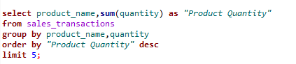

# Retail-Sales-Insights
The Retail Sales Insights project investigates customer transactions together with sales trends and business performance through SQL query analysis. This assessment presents organized sales analytics which enables businesses to make data-based choices for their expansion and operational efficiency.

# Objectives

This project  primary objectives  are:

- The evaluation of sales transactions. Bring forward trends in transaction data such as yearly revenue statistics alongside citywide transaction counts and shopping patterns among customers.

- The evaluation of product performance. Focus on identifying best-selling items and single product counts by category and market demand fluctuations between product ranges.

- Customer Insights. Helps find high-value customers as well as monitor their transaction behavior and purchasing frequencies and evaluation of their cross-category purchase trends.

- Revenue Analysis to detect how revenue splits between different product groups and which sections generate the highest profits while tracking annual revenue increases.

- An analysis of payment methods. Allows companies to identify standard and profitable payment methods which helps optimize checkout operations.

- Sales Growth Trends. Require analysis of monthly sales development with yearly sales performance data along with customer spending pattern observations.

- The analysis should uncover business improvement potentials which cover preferred purchasing periods and seasonal sales patterns besides recognizing customers who boost their spending.

- Analyze Company consumers who reduced their buying habits to stop customer departures through specific advertising campaigns.

- A review of sales performance conducted across different locations to discover new markets where the company could expand its business operations.

# Data Set Used

- Customer_infor table: It contains information about the customers
- Sales_transaction table:This table contains product name alongside category information and quantity details and total amount information and transaction date records.

# Tools and Technologies Used

- PostgreSQL. Act as the database management system to process customer and sales information with high efficiency.
  
- Query Language. The database management system uses the query language SQL (Structured Query Language) for retrieving and processing data through aggregation operations while filtering and performing analytical calculations.

- Debeaver for query execution and database administration.

  # Key Insights & Findings

- Locations/City with higher sales transaction counts.
North Michael,South Vicki had the highest transactions counts display business opportunities for new ventures
compared to Locations such as South Amy,Lake Elaineburgh among others which shows  least transaction counts.

- The list of top five most purchased products. Allows businesses to understand which products customers prefer and which ones generate increased demand. 
In this case; Microwave,Fridge,Smartphone,Sneakers,Fridge are the top 5 most purchased products.

- Average transaction amount per category.This metric enables companies to identify the product categories resulting in maximum revenue generation.
From this analysis, Furniture category had the highest average amount transactions followed by Electronics then Home Appliances then Accessories and finally
Footwear.

- Payment method that has the highest sales. Payment Methods Analysis allows businesses to determine optimal payment methods by examining their customer purchasing behavior.
  From the analysis we found that, PayPal generated total sales  of 229,631 was the most preffered method of payment followed by ,bank with total sales of 188,428,
  creditcard with sales of 184,720,Cash with sales of 155,910 and finally Debit Card with sales of 153,049.

  

- Customers with at Least 5 Transactions – Identifies loyal and repeat customers.
  From analysis, there was no customer who had made more than 5 transactions.

  

- The Last 6 Months of Customer Registration without Transactions. Serves as tool for marketing campaign planning towards new customers.
  From the analysis, no customer has been registered in the last 6 months. This shows that company needs to do a serious marketing.

  

- Yearly Revenue Trends – Evaluates business growth and sales performance over time.
  From the analysis, 2023 had the most sales(332,200) followed by 2024(270,944),2022(234,884),2025(73710) respectively.

  

- Number of unique products sold in each category.A business can measure inventory variety through counting unique product sales per product category.
From the analysis, we had 10 unique products sold in each category namely:Headphones,Tablet,Bed,Sofa,Washing Machine,Smartphone,Microwave,Fridge,Laptop,Sneakers.

- Customers who have made purchases across at least 3 different product categories.
The analysis system detects customers who buy items within different categories through this feature for delivering personalized recommendations.

- The most popular purchase day of the week based on transaction count.
  Most Popular Purchase Day enables businesses to maximize their promotional strategies along with sales performance.
  From the analysis, Tuesday is the most popular purchase day with a count of 64.

  

#  Advanced Insights

- The list of Top 3 Customers by Spending in the Last 12 Months assists in developing retention programs for valuable clients.
  From the analyis we had customers of id 1283 with the total spending of 15,811 , customer of id 1405 with the total spending of 15,191
  and customer of id 1788 with the total spending of 13,828 as the top 3 customers respectively.

  

- Determine the percentage of total revenue contributed by each product category.
  Assessing revenue production through various categories permits more effective resource and budget distribution for marketing purposes.
From the analysis  Electronics Category had the highest revenue contribution of 333646.00 followed by Furniture with 272569.00,
then Home Appliances with 267101.00, then Accessories with 19851.00 abd finally Footwear category with 18571.00.

  
- Find the month-over-month sales growth for the last 12 months.
Month-over-Month Sales Growth – Analyzes business growth patterns.

- Identify customers who have increased their spending by at least 30% compared to the previous year.
Customers with Increased Spending by 30% – Identifies potential VIP customers.

- Find the first purchase date for each customer.
First Purchase Date for Each Customer – Helps in customer lifecycle and retention strategies.

